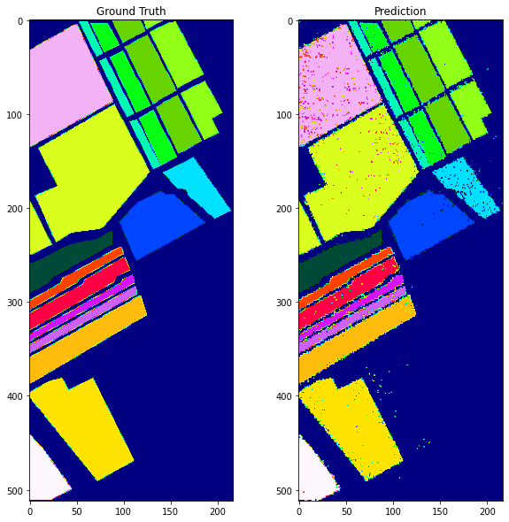

# Hyperspectral image classification  [](https://colab.research.google.com/github/breathingcyborg/hyperspectral-image-classification/blob/main/hsi_classification.ipynb)

Identifying healthy crops, identifying quality and freshness of food, estimating crop yield, finding leak in oil pipeline, fire detection, land cover classification, estimating soil composition, estimating pollution levels, identifying fake medicine are just one of few things that can be done using hyperspectral image classification.

Hyperspectral images are different from images captured by normal camera, a normal camera captures image in three bands red, green, blue. Red band captures red light reflected by an object. Hyperspectral cameras capture image using 100s of bands. Each bands captures a narrow portion of electromagnetic spectrum. Hyperspectral image classification assign labels to each pixel of the image. Label could be something like brocoli, damaged brocoli, water, land etc. In image below each category is represented by a color.


# Dataset.

[Salinas](https://rslab.ut.ac.ir/data) dataset is used, the image is captured using [aviris](https://aviris.jpl.nasa.gov/) sensor. Each image is captured using 224 bands, ranging from 400nm to 2500nm. Here is image of 9 random bands of the hyperspectral image.


There are 17 classes in salinas dataset, we have to assign class to each pixel of the dataset. As you can see more than 50% of image has label unknown.


# Model
There are 224 bands in the image, which is a lot of data to process. Many bands contain similar information. Using Princial Component Analysis it was found that 99.95% of variance of image could be explained using only 27 bands. Random Search was performed to select hyperparams for PCA and Random Forest.

# Results

## Classification Report
* We are getting 92% accuracy. 
* Few classes like Fallow, Fallow_rough_plow, Lettuce_romaine_6wk, Lettuce_romaine_7wk, Grapes_untrained and Vineyard_untrained are performing poorly. 
* Remaining classes have good precision,recall and f1 around 90%

```
                           precision    recall  f1-score   support

                  Unknown       0.94      0.95      0.94     11395
    Brocoli_green_weeds_1       0.88      0.96      0.92       402
    Brocoli_green_weeds_2       0.94      0.97      0.96       745
                   Fallow       0.88      0.68      0.77       395
        Fallow_rough_plow       0.92      0.81      0.86       279
            Fallow_smooth       0.88      0.91      0.89       536
                  Stubble       0.95      0.97      0.96       792
                   Celery       0.94      0.97      0.95       716
         Grapes_untrained       0.83      0.92      0.87      2254
     Soil_vinyard_develop       0.95      0.91      0.93      1241
Corn_senesced_green_weeds       0.96      0.91      0.93       656
      Lettuce_romaine_4wk       0.92      0.91      0.91       213
      Lettuce_romaine_5wk       0.91      0.89      0.90       385
      Lettuce_romaine_6wk       0.85      0.83      0.84       183
      Lettuce_romaine_7wk       0.85      0.84      0.84       214
        Vinyard_untrained       0.86      0.75      0.80      1454
 Vinyard_vertical_trellis       0.95      0.96      0.95       361

                 accuracy                           0.92     22221
                macro avg       0.91      0.89      0.90     22221
             weighted avg       0.92      0.92      0.92     22221
```

## Confusion Matrix

* We can clearly see there is lot of confusion between Grapes and Vineyard.
* There is lot of confusion between all classes and unknown class.


## Prediction
